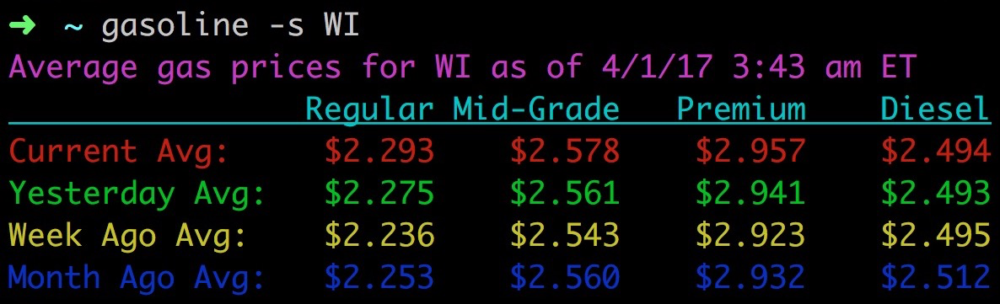

# gasoline

Simple CLI utility for U.S. state gas prices updated from [AAA's Gas Prices](http://gasprices.aaa.com/).



## Install

Gasoline is not published in the npm Registry so installation is done within the project directory with:

```sh
$ npm install --global
```

## Usage

State abbreviations are the 50 U.S. states, including `DC` for Washington D.C. and `US` for national U.S. gas prices.

```sh
$ gasoline -s [state abbreviation]
```

## License

This project is licensed under the MIT License - see the [LICENSE](LICENSE) file for details.
